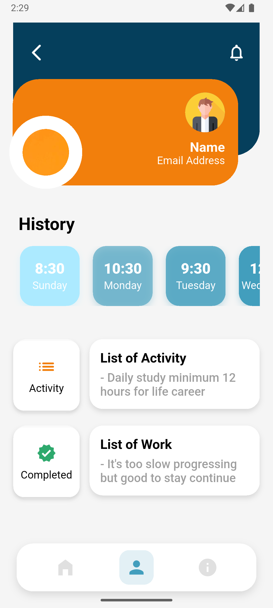
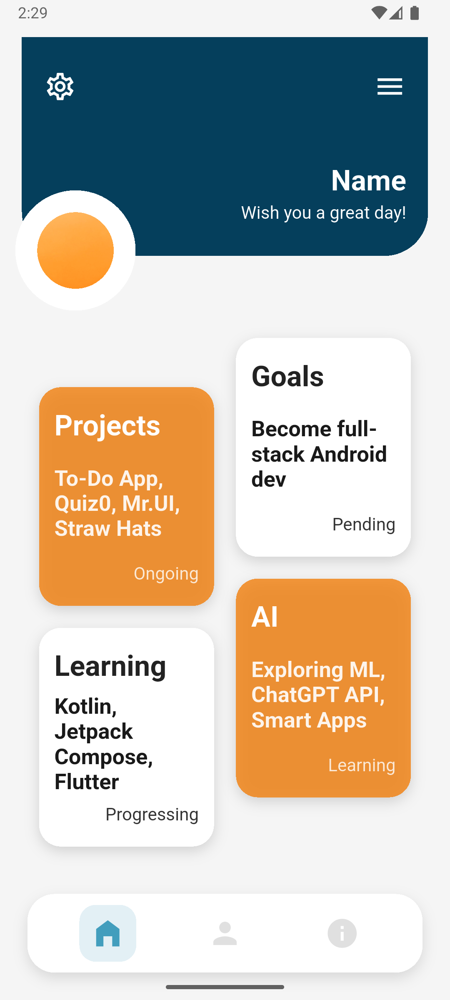
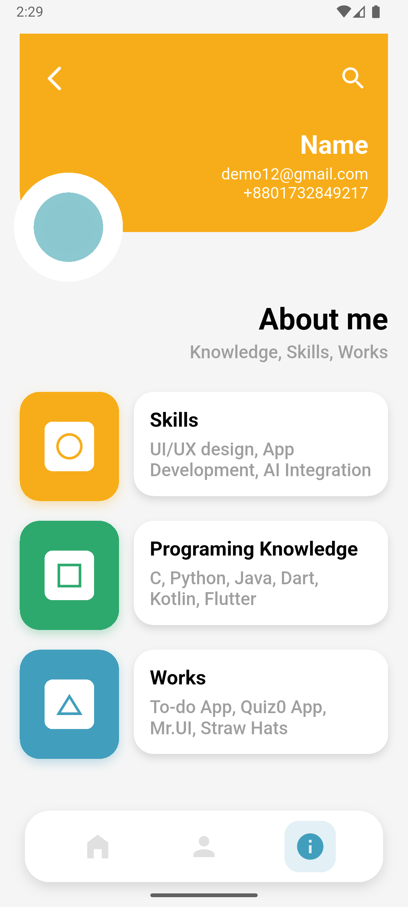

# UI-Screens-1

A Flutter UI exploration project featuring modern layout compositions and design experiments.  
This project demonstrates clean UI structure, component organization, and visual consistency.

---

## Screenshots

<table align="center">
  <tr>
    <td align="center">
      
    </td>
    <td align="center">
      
    </td>
    <td align="center">
      
    </td>
  </tr>
</table>

---

## Getting Started

This project serves as a starting point for building Flutter applications with a focus on UI design.  
If you’re new to Flutter, begin with these resources:

- [Write your first Flutter app](https://docs.flutter.dev/get-started/codelab)
- [Flutter Cookbook](https://docs.flutter.dev/cookbook)

For in-depth documentation, visit the [official Flutter docs](https://docs.flutter.dev/).

---

### Setup

To run this project locally:

```bash
git clone https://github.com/<your-username>/UI-Screens-1.git
cd UI-Screens-1
flutter pub get
flutter run
